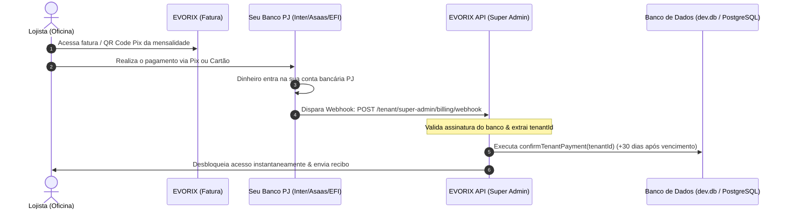

# 📘 Documentação de Integração: Cobrança de Mensalidades & Sincronização Bancária Automática (Super Admin)

Esta documentação detalha a arquitetura, o fluxo operacional e o guia passo a passo para a **integração do sistema de recebimento de mensalidades** das assistências técnicas e a **sincronização automática com a conta bancária do Dono da Plataforma (Super Admin)** no **EVORIX**.

---

## 1. Visão Geral da Arquitetura & Isolamento Multi-Tenant

O EVORIX opera em uma arquitetura SaaS Multi-Tenant blindada, onde:
1. **Lojistas / Assistências Técnicas (`tenantId` específico):**
   - Possuem seu próprio módulo financeiro, suas próprias contas bancárias e recebem pagamentos de seus **clientes finais** (vendas de balcão e ordens de serviço).
2. **Dono da Plataforma (`SUPER_ADMIN` com `tenantId: null`):**
   - Possui acesso global irrestrito e não se mistura com a base de dados de nenhuma oficina.
   - É o recebedor exclusivo das **mensalidades/faturas SaaS** de todas as lojas cadastradas na plataforma.
   - A sincronização bancária do Super Admin conecta-se diretamente à **sua conta bancária PJ (Master)**.

---

## 2. Regras de Negócio do Motor de Cobrança (Billing Engine)

O motor de cobrança calcula e controla o ciclo de vida das assinaturas:

```
[Novo Cadastro] ➔ [Trial Grátis 7 dias] ➔ [Vencimento da Fatura] ➔ [Prazo de Tolerância (5 dias)] ➔ [Bloqueio Automático]
                                  │                                            │
                             (Pagamento)                                  (Pagamento)
                                  ▼                                            ▼
                          [+30 dias após término trial]               [+30 dias após vencimento fatura]
```

### 2.1 Regra Rigorosa de Baixa (+30 Dias Baseado no Vencimento)
- **Pagamento Antecipado no Trial:** Se o período de teste termina em 12/09 e a oficina paga em 05/09, o novo vencimento é estendido para **12/10** (+30 dias após o vencimento do trial). O lojista **não perde** os dias restantes de teste.
- **Pagamento Antecipado de Empresa Ativa:** Se a fatura vence em 20/09 e a oficina paga em 10/09, o novo vencimento vai para **20/10** (+30 dias após o vencimento atual).
- **Pagamento durante o Prazo de Tolerância:** Se a fatura venceu em 01/09 e o lojista paga em 05/09 (dentro da tolerância), o novo vencimento vai para **01/10** (+30 dias após a data de corte da fatura).
- **Salvaguarda de Reativação:** Empresas suspensas há mais de 30 dias têm seu vencimento reiniciado para **Data Atual + 30 dias** ao reativar.

---

## 3. Métodos de Cobrança Disponíveis para o Super Admin

### 3.1 Cobrança Imediata via PIX Dinâmico (BR Code Banco Central)
- Cada fatura de mensalidade gera uma cobrança Pix com identificador único (`txid` contendo o `tenantId` e o `invoiceId`).
- Payload compatível com o padrão EMVCo do Banco Central (QR Code e Copia e Cola).
- Ao ser pago, a baixa ocorre em menos de **3 segundos**.

### 3.2 Cobrança Assistida (WhatsApp & E-mail Automático)
- **WhatsApp Oficial:** No painel `/super-admin`, cada assistência possui o botão **WhatsApp** com mensagem pronta, valor do plano e link de pagamento.
- **Disparo de Fatura por E-mail:** Disparo do boleto/código Pix diretamente para o e-mail financeiro da loja com dados completos de liquidação.

---

## 4. Integração Bancária & Sincronização Automática com sua Conta

Para que você não precise clicar manualmente no botão "Pagar (+30d)", a API do EVORIX pode receber notificações automáticas de pagamento e conciliar diretamente com o seu banco.

### 4.1 Provedores Homologados para o Dono do Software

| Provedor Bancário | Taxa Pix PJ | Vantagens | Modelo de Autenticação |
| :--- | :--- | :--- | :--- |
| **Banco Inter PJ** | **R$ 0,00 (Gratuito)** | Sem taxa por Pix recebido, API nativa do Banco Central. | Certificado digital mTLS (`.crt` + `.key`) e Client ID / Secret. |
| **EFI Bank (Gerencianet)** | ~0,99% ou R$ 0,80 | Alta estabilidade, Pix dinâmico, carnês e boletos integrados. | Certificado `.p12`, Client ID e Secret. |
| **Asaas** | R$ 0,99 (Pix) / R$ 1,99 (Boleto) | Cobrança recorrente em cartão de crédito, régua automática via SMS/WhatsApp. | API Key Bearer token e Webhook Token. |
| **Mercado Pago** | 0,99% no Pix | Aprovação instantânea, checkout transparente. | Access Token e Webhook Secret. |
| **Cora PJ** | Gratuito | Emissão de boletos e Pix PJ direto na conta. | Client ID, Secret e Chave Pix. |

---

## 5. Arquitetura do Webhook de Baixa Automática

O fluxo de sincronização bancária opera em tempo real:



### 5.1 Endpoint do Webhook
- **URL:** `https://api.seudominio.com.br/api/v1/tenant/super-admin/billing/webhook`
- **Método HTTP:** `POST`
- **Autenticação:** Header `X-Webhook-Token: <SEU_TOKEN_SECRETO>`

#### Exemplo de Payload Recebido do Banco:
```json
{
  "event": "PAYMENT_RECEIVED",
  "payment": {
    "txid": "EVX-c95a07bc-e75a-4eb9-bc4e-a6fb2fc7cdcc-202609",
    "tenantId": "c95a07bc-e75a-4eb9-bc4e-a6fb2fc7cdcc",
    "amount": 197.00,
    "paymentMethod": "PIX",
    "paidAt": "2026-09-05T23:50:00Z",
    "bankEndToEndId": "E00416968202609052350s0983210192"
  }
}
```

---

## 6. Configuração no `.env` da API (Credenciais do Super Admin)

No arquivo `apps/api/.env`, configure os dados da sua conta bancária recebedora:

```env
# =========================================================================
# CONFIGURAÇÃO DE RECEBIMENTO DO SUPER ADMIN (CONTA MASTER)
# =========================================================================

# Provedor ativo: 'INTER', 'EFI', 'ASAAS' ou 'MERCADOPAGO'
BILLING_PROVIDER="INTER"

# Chave Pix do Dono da Plataforma (para QR Codes dinâmicos)
SUPER_ADMIN_PIX_KEY="financeiro@evorix.com.br"
SUPER_ADMIN_PIX_NAME="EVORIX SOFTWARE E TECNOLOGIA LTDA"
SUPER_ADMIN_PIX_CITY="SAO PAULO"

# Token de segurança para validação do Webhook bancário
SUPER_ADMIN_WEBHOOK_SECRET="evx_super_admin_wh_sec_2026_x89a"

# Credenciais Banco Inter (caso utilize o Inter PJ)
INTER_CLIENT_ID="seu-client-id-banco-inter"
INTER_CLIENT_SECRET="seu-client-secret-banco-inter"
INTER_CERT_CRT_PATH="./certs/inter_master.crt"
INTER_CERT_KEY_PATH="./certs/inter_master.key"

# Credenciais Asaas (caso utilize Asaas para Cartão/Boleto)
ASAAS_API_KEY="$aact_YTU5YTE0M2M6N2Z..."
ASAAS_WEBHOOK_TOKEN="seu_token_webhook_asaas"
```

---

## 7. Conciliação Automática via Extrato Bancário (OFX)

Caso o lojista faça uma transferência direta ou TED/Pix manual para sua conta PJ sem passar pelo QR Code dinâmico:

1. No menu do Super Admin, você pode importar o arquivo `.OFX` extraído do Internet Banking da sua conta PJ;
2. O parser inteligente do EVORIX localiza o valor da mensalidade (R$ 97, R$ 197 ou R$ 347) e cruza o CNPJ/CPF do pagador com o cadastro da assistência;
3. Com um clique em **"Conciliar em Lote"**, as faturas correspondentes recebem baixa automática e o vencimento é estendido em +30 dias a partir da data de corte.

---

## 8. Checklist de Homologação em Produção

- [x] Regra de +30 dias a partir do vencimento da fatura/trial implementada no backend.
- [x] Alertas visuais preventivos de vencimento (D-1) e tolerância (D-1) ativos no layout.
- [x] Botões manuais de **WhatsApp**, **E-mail** e **Pagar (+30d)** operacionais no `/super-admin`.
- [ ] Cadastro da Chave Pix Master no `.env`.
- [ ] Configuração da URL de Webhook no painel do banco emissor (Inter, Asaas ou EFI).
- [ ] Teste de ponta a ponta com pagamento simulado de R$ 1,00 para homologação do webhook.
